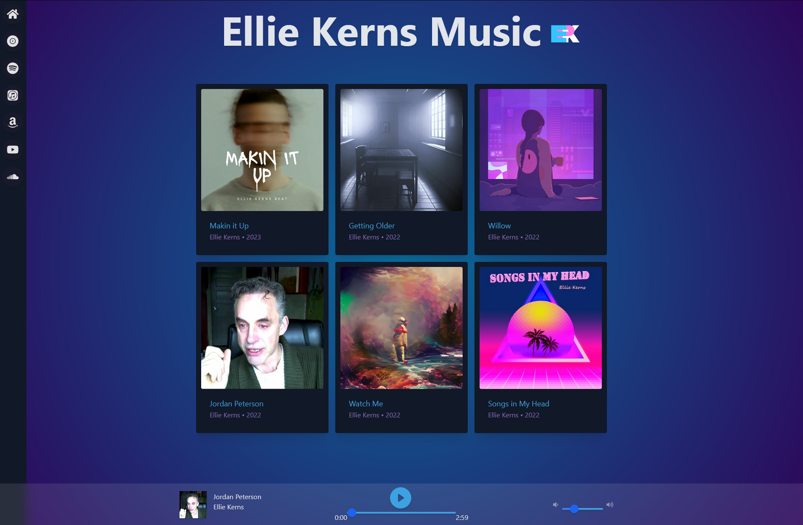

# React Music App in Docker
# [Live Site](https://music.epklabs.com)

## Front end made with React, Redux Toolkit, Vite, and Tailwind CSS.

## Backend made with Express and SQLite. 

# React Music App in Docker 1.0 Release Notes

I'm excited to announce the first official release of React Music App in Docker. This version includes a wide range of features designed to provide an immersive and easy-to-use music streaming experience. Here's what you can expect:

## Music Streaming Experience
Currently, you can listen to all of my released music. Select a track from the list list and enjoy continuous playback with minimal latency.

## Audio Player
The custom built audio player gives you full control over your listening experience. Play, pause, control the volume, and even see your progress through the song with our interactive progress bar.

## Stunning User Interface
Easy to browse my current selection and links to my music on other streaming platforms. Enjoy high-quality album artwork, song details, and smooth navigation.

## Responsive Design
Whether you're on a desktop or mobile device, my music player is designed to provide a seamless experience.

## Docker Integration
With Docker setup for both the front-end and the back-end, we ensure a consistent environment, making the app easy to launch and maintain, regardless of your operating system.

## Enhanced Error Handling
Improved error handling to provide a better user experience. Loading indicators keep you informed while your music loads, and error messages guide you when something goes wrong.

## Performance Optimization
I've worked hard to iron out bugs and optimize performance. This version of the app provides faster load times and smoother overall operation, ensuring an uninterrupted music listening experience.

## Coming Soon: Artist Template (v1.5)
Though everyone is free to fork the repo now and start customizing, I'm working on an update that will include a template version of the app, designed for artists to easily replace the default music with their own and customize the styling. Stay tuned for version 1.5!

Thanks for checking this out! I'm excited to bring you this version and look forward to your feedback.

*Current license restrictions due to app containing my personal copywritten music. Upon Completion, template will be licensed under MIT.*
